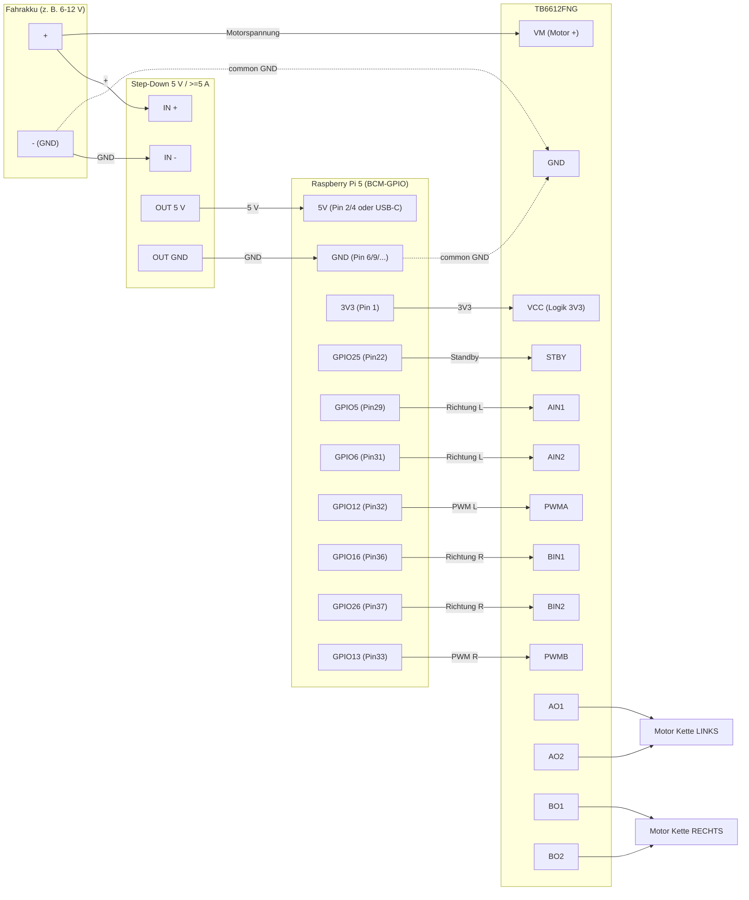

# Fahrwerk: Makeblock Ranger Tank-Chassis mit TB6612FNG

Ansteuerung der beiden Ketten (links/rechts) des Tank-Chassis über einen
Raspberry Pi 5 und den Doppel-Motortreiber TB6612FNG.

## Komponenten

| Komponente | Funktion |
|---|---|
| Raspberry Pi 5 | Logik, Web-UI, GPIO-Steuerung |
| TB6612FNG | Doppel-H-Brücke, treibt beide DC-Getriebemotoren |
| 5-V-Step-Down-Wandler (≥ 5 A) | Versorgt den Pi 5 stabil (Pi 5 zieht Lastspitzen) |
| Fahrakku | Versorgt die Motoren (VM des TB6612FNG) |

Die beiden Motoren des Ranger-Chassis = **Kette links** (Kanal A) und
**Kette rechts** (Kanal B).

## Stromversorgung (wichtig)

- **Getrennte Pfade:** Der Step-Down (5 V / ≥ 5 A) versorgt **nur den Pi 5**.
  Die Motoren laufen über `VM` direkt aus dem Fahrakku (nicht über den Pi-5-V-Rail).
- **Gemeinsame Masse:** GND von Pi, TB6612FNG und Akku müssen verbunden sein.
- `VM` = Motorspannung (Fahrakku, je nach Ranger-Motoren typ. 6–12 V).
- `VCC` = Logikspannung des TB6612FNG → an **3V3** des Pi (Logikpegel passend zu den 3,3-V-GPIOs).

## Pin-Belegung

GPIO-Nummern sind **BCM** (konfigurierbar in `config/hardware.yaml` → `motor:`).
Die physischen Pin-Nummern beziehen sich auf die 40-polige Pi-Stiftleiste.

| TB6612FNG | Funktion | Pi BCM (GPIO) | Pi physisch |
|---|---|---|---|
| STBY | Standby (HIGH = aktiv) | 25 | 22 |
| AIN1 | Richtung links | 5 | 29 |
| AIN2 | Richtung links | 6 | 31 |
| PWMA | Tempo links (PWM) | 12 | 32 |
| BIN1 | Richtung rechts | 16 | 36 |
| BIN2 | Richtung rechts | 26 | 37 |
| PWMB | Tempo rechts (PWM) | 13 | 33 |
| VCC | Logik 3,3 V | 3V3 | 1 oder 17 |
| GND | Masse (gemeinsam) | GND | z. B. 6, 9, 14, 20, 25, 30, 34, 39 |
| VM | Motorakku + | – (Fahrakku) | – |
| AO1/AO2 | Motor Kette links | – | – |
| BO1/BO2 | Motor Kette rechts | – | – |

Die Spray-Pins (Düse 17, Pumpe 27, Tank 22/23) bleiben frei von diesen Belegungen.

## Wiring-Diagramm



> Durchgezogene Linien = Verdrahtung, gestrichelte Linien = gemeinsame Masse
> (Pi GND, Treiber GND und Akku-Minus müssen verbunden sein).

## Logik (TB6612FNG-Wahrheitstabelle pro Kanal)

| IN1 | IN2 | PWM | Verhalten |
|---|---|---|---|
| 1 | 0 | Tempo | vorwärts |
| 0 | 1 | Tempo | rückwärts |
| 0 | 0 | – | Leerlauf/Stopp |
| 1 | 1 | – | Bremse |

Geschwindigkeit = PWM-Tastgrad (0–100 %), Standard-PWM-Frequenz 1 kHz
(`motor.pwm_frequency_hz`).

## Software-Architektur

Gemäß Projektregeln steuert **nur der Core-Prozess** die GPIOs; die Web-UI löst
nie direkt Motoren aus, sondern legt Befehle als Datei ab (`drive_command.json`),
analog zur Anlernfahrt-Aufnahme.

```
Web-UI (DrivePage)
  └─ POST /api/drive/command {left, right}        # -1..1 je Kette
       └─ drive_command.json  (Shared Volume)
            └─ core: _poll_drive() → DriveController.set_speeds()
                 └─ MotorDriver → TB6612FNG GPIO/PWM
core: drive_status.json ← DriveController.status_dict()
  └─ GET /api/drive/status → DrivePage (Live-Anzeige)
```

### Sicherheit: Totmann-Watchdog

Der `DriveController` läuft in einem Worker-Thread und stoppt die Motoren
automatisch, wenn innerhalb von `drive.watchdog_timeout_ms` (Standard 1000 ms)
kein neuer Befehl eintrifft. Die Web-UI sendet daher alle ~300 ms einen
Keepalive, solange ein Richtungsknopf gehalten wird; beim Loslassen wird sofort
gestoppt.

## Konfiguration

`config/defaults.yaml`:

```yaml
drive:
  enabled: true
  max_speed: 1.0            # globale Tempo-Begrenzung (0..1)
  watchdog_timeout_ms: 1000
  invert_left: false        # umkehren, falls eine Kette verkehrt läuft
  invert_right: false
```

Pin-Anpassungen pro Gerät in `config/local.yaml` (gitignored), z. B.:

```yaml
motor:
  left_in1: 5
  left_in2: 6
  left_pwm: 12
  right_in1: 16
  right_in2: 26
  right_pwm: 13
  standby: 25
```

## Inbetriebnahme

1. Verdrahtung nach Tabelle, gemeinsame Masse prüfen.
2. `drive.enabled: true` setzen.
3. In der Web-UI unter **Fahren** zunächst mit geringer Geschwindigkeit testen.
4. Läuft eine Kette falsch herum: `invert_left`/`invert_right` umschalten.
5. Dreht der Roboter bei „vorwärts“ statt geradeaus, sind die Kanäle/Motoren
   vertauscht → Verdrahtung oder Invert-Flags anpassen.
